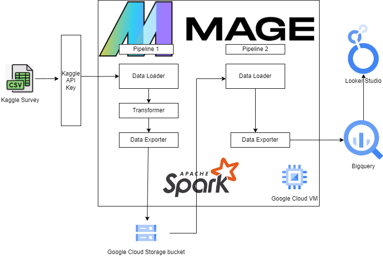
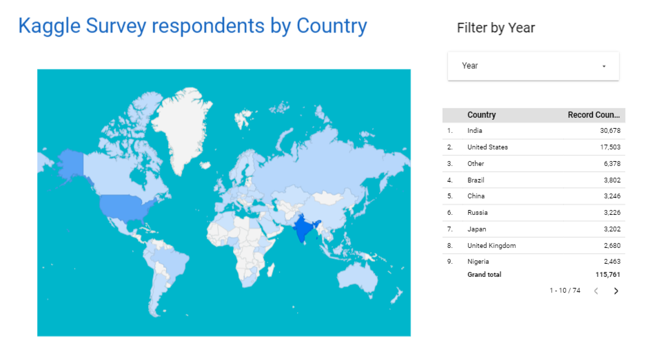
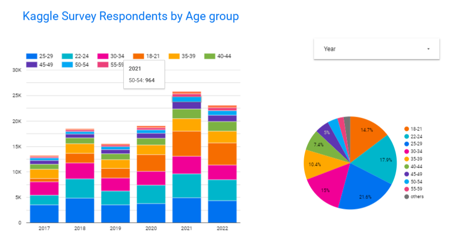
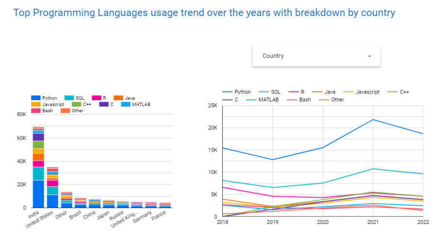
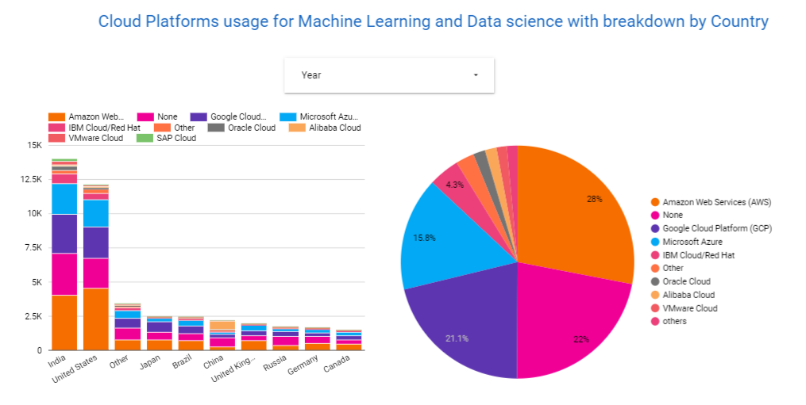

<!-- omit in toc -->
# Kaggle Machine Learning and Data Science Survey 2017-2022

- [Introduction](#introduction)
- [Project Overview](#project-overview)
- [Dataset and its challenge](#dataset-and-its-challenge)
- [Technologies](#technologies)
- [Dashboard](#dashboard)
  - [Where are most survey respondents from?](#where-are-most-survey-respondents-from)
  - [What percentage of repondents are under 30 years old?](#what-percentage-of-repondents-are-under-30-years-old)
  - [What are the top programming languages for machine learning and data science?](#what-are-the-top-programming-languages-for-machine-learning-and-data-science)
  - [What cloud plaforms are mostly used for machine learning and data science?](#what-cloud-plaforms-are-mostly-used-for-machine-learning-and-data-science)
- [Reproducibility](#reproducibility)
- [Version Control](#version-control)
- [Conclusion](#conclusion)

## Introduction
This data engineering project is part of [DataTalksClub's data engineering zoomcamp](https://github.com/DataTalksClub/data-engineering-zoomcamp) 12-weeks course. The dataset chosen for this project is Kaggle Machine Learning and Data Science Survey, an annual survey conducted by [Kaggle](http://www.kaggle.com), an online community platform focused in the area of machine learning and data science. The survey provides a comprehensive overview of the current state of data science and machine learning at the time. It asks participants from all over the world questions regarding a wide range of topics including demographics, education, industry trends, preferences, programming languages, salaries, tools, techniques, and much more as it pertains to the area of data science and machine learning.

## Project Overview

 
 This project demonstrates the creation of end-to-end data engineering pipelines that leveraged the use of the technologies learned throughtout the course for loading and transforming datasets. In this project, a first Mage pipleline loads Kaggle dataset csv file from kaggle website into a spark dataframe using Kaggle api key. The dataframe then underwent a number of transformation activities to produce a refined dataset that is then exported into a Google cloud Storage bucket. The pipleline then calls a second pipeline to load the transformed data from the bucket and exports it into multiple Bigquery tables. The bigquery tables are then linked to Google Looker studio to produce visualization reports.

## Dataset and its challenge
The [dataset](https://www.kaggle.com/datasets/adenrajput/merged-kaggle-survey-data) chosen for this project merged the results of the Kaggle Machine Learning and Data Science Survey for the years 2017 through 2022. The dataset consists of 297 columns and 130K rows. A subset of these columns were used for the project. The challenge with the dataset was that some survey questions had multi-choice answers and each answer was stored in a separate column. These answers were merged into new columns as comma separated values. They were later exploded into multiple rows as they were stored in separate bigquery tables.

## Technologies
* [Mage AI](https://www.mage.ai/) for orchestrating workflow
* [Apache Spark](https://spark.apache.org/) for both batch processing and transformation
* [Terraform](https://www.terraform.io/) for provisioning Google cloud services
* [Google Cloud VM](https://console.cloud.google.com/compute) for running the project
* [Google Cloud Storage](https://cloud.google.com/storage) for data lake storage
* [Google BigQuery](https://console.cloud.google.com/bigquery) for data warehousing and analysis
* [Google Looker Studio](https://lookerstudio.google.com/overview) for dashboard

## Dashboard
Created multiple graphs using Google Looker Studio to visualize the insights derived from the processed data.
### Where are most survey respondents from?

India and the United States  
[Direct Link](https://lookerstudio.google.com/reporting/9564c465-921f-4448-8bd0-36223290679d)

### What percentage of repondents are under 30 years old?

54% of respondents are under 30 years old  
[Direct Link](https://lookerstudio.google.com/reporting/9564c465-921f-4448-8bd0-36223290679d)

### What are the top programming languages for machine learning and data science?

Python and SQL  
[Direct Link](https://lookerstudio.google.com/reporting/473f0cc0-5433-4f5b-a6ad-467ee66e4bfb)

### What cloud plaforms are mostly used for machine learning and data science?

78% of respondents uses a cloud plaforme with AWS at the top with 28% usages followed by Google Cloud at 21%  
[Direct Link](https://lookerstudio.google.com/reporting/1d769c65-7476-4d29-9aa0-ccef4d551c9f)

## Reproducibility
1. [**Google Cloud Infrastructure Setup**](terraform/terraform.md): Steps to run terraform to provision the Google cloud instracture components. 
2. [**Anaconda Installation**](anaconda/anaconda.md): Steps to install python environment with packages such as jupyter notebook.
3. [**Spark Installation**](spark/spark.md): Steps to install and configure Apache spark
4. [**Kaggle API Key**](kaggle/kaggle.md): Steps to generate Kaggle API key to be used in Mage project
5. [**BigQuery Tables**](bigquery/bigquery.md): Create scripts for the Bigquery tables
6. [**Mage Installation and configuration**](mage/mage.md): Steps to install, configure, and run Mage
7. [**Google Looker Studio**](https://lookerstudio.google.com/overview): Use your google account to connect Looker to your bigquery tables

## Version Control
This GitHub repository manages the project's documentation and codebase. It has been cloned to the Google VM for seamless development and deployment.

## Conclusion

This project showcases the capabilities of latest data engineering technologies by utilizing a combination of cloud services, data processing tools, and visualization techniques to extract meaningful insights from the Kaggle Machine Learning and Data Science Survey dataset.