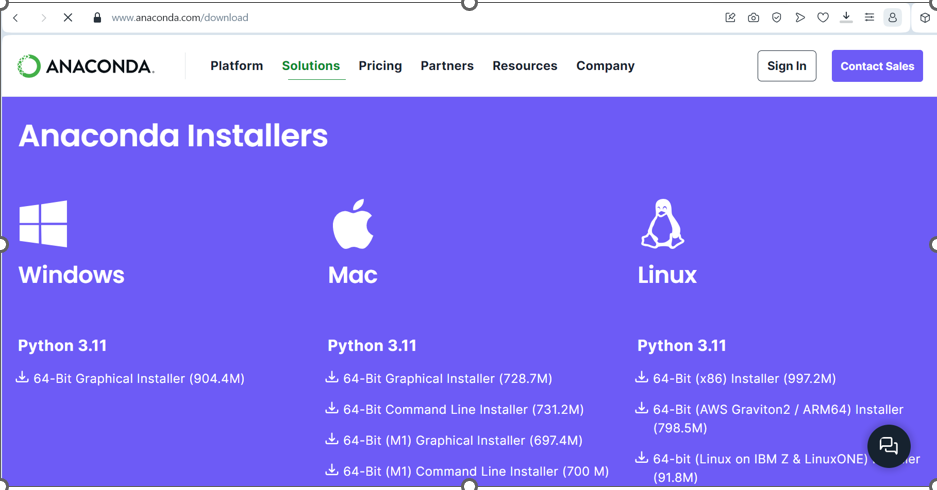
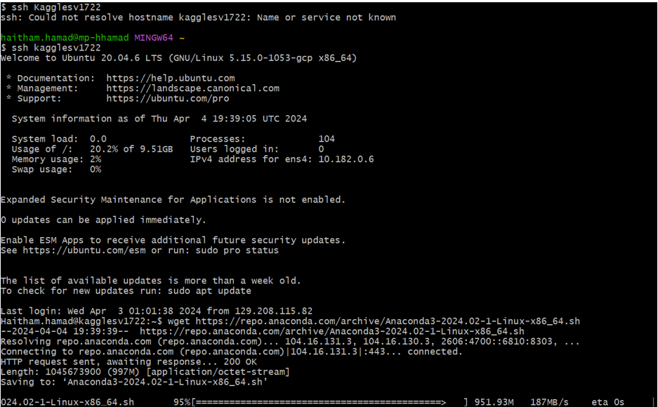
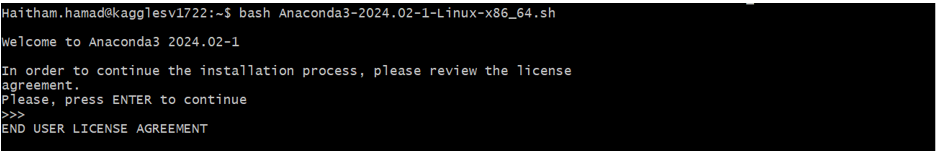
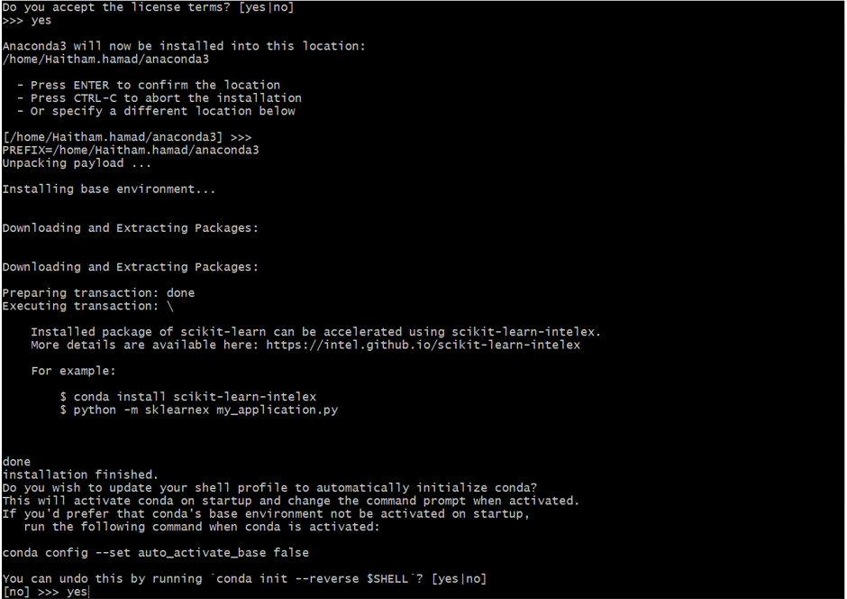
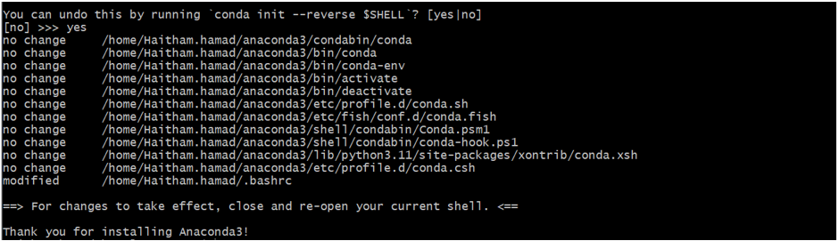
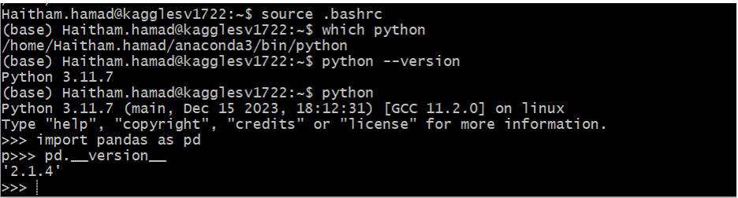

# Install Anaconda

Go to https://www.anaconda.com/products/individual

Right-click on Linux->Python 3.11->64-bit (x86) installer and copy the link

ssh to the VM and run wget with the copied link

Run 
`bash Anaconda3-2024.02-1-Linux-x86_64.sh`

Press space to scroll down to end of agreement and accept

Press ENTER to confirm the location
And yes to update shell profile

Verify Installation
