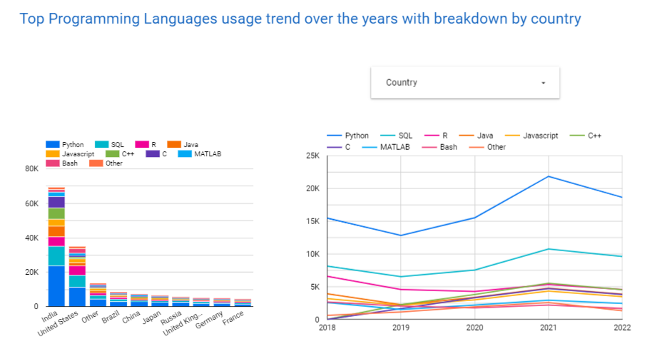

# Where are most survey respondents from?

India and the United States  
[Direct Link](https://lookerstudio.google.com/reporting/9564c465-921f-4448-8bd0-36223290679d)

# What percentage of repondents are under 30 years old?

54% of respondents are under 30 years old  
[Direct Link](https://lookerstudio.google.com/reporting/9564c465-921f-4448-8bd0-36223290679d)

# What are the top programming languages for machine learning and data science?

Python and SQL  
[Direct Link](https://lookerstudio.google.com/reporting/473f0cc0-5433-4f5b-a6ad-467ee66e4bfb)

# What cloud plaforms are mostly used for machine learning and data science?

78% of respondents uses a cloud plaforme with AWS at the top with 28% usages followed by Google Cloud at 21%  
[Direct Link](https://lookerstudio.google.com/reporting/1d769c65-7476-4d29-9aa0-ccef4d551c9f)