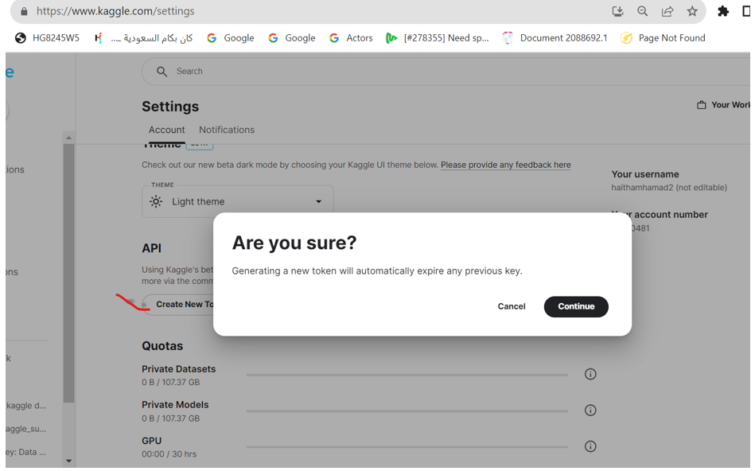

# Kaggle API Key

Kaggle provides a Kaggle API key generation to download Kaggle datasets

Login to https://www.kaggle.com or register as new user

Go to account settings


A kaggle.json file will be downloaded locally. Copy the file to your VM machine and under .kaggle folder

```
mkdir ~/.kaggle
cp kaggle.json ~/.kaggle/
chmod 600 ~/.kaggle/kaggle.json
```