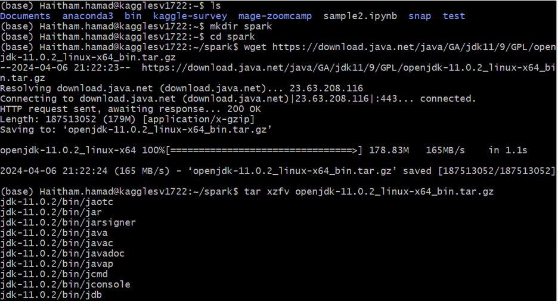
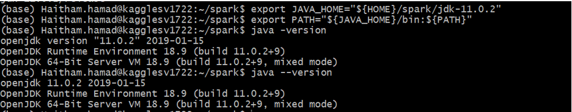
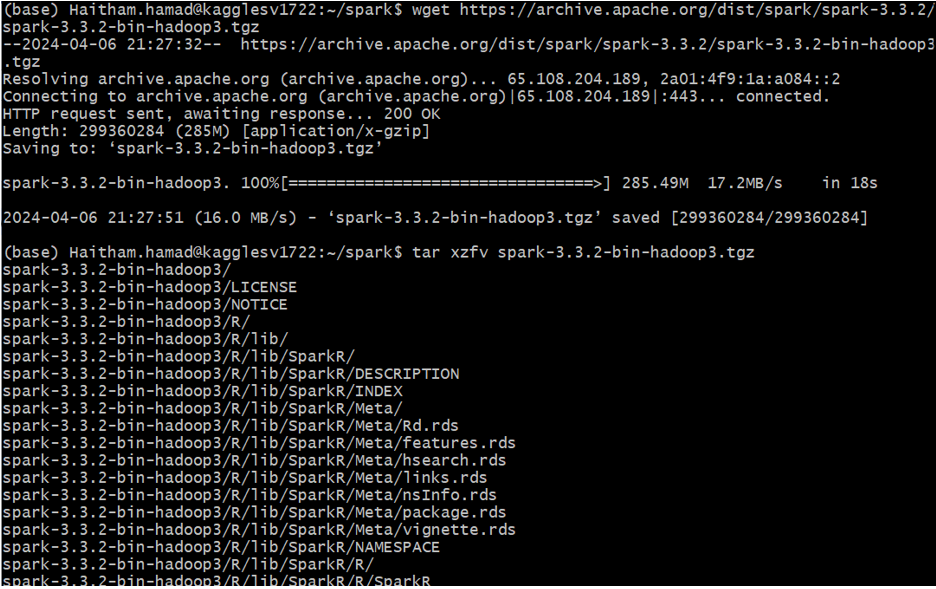
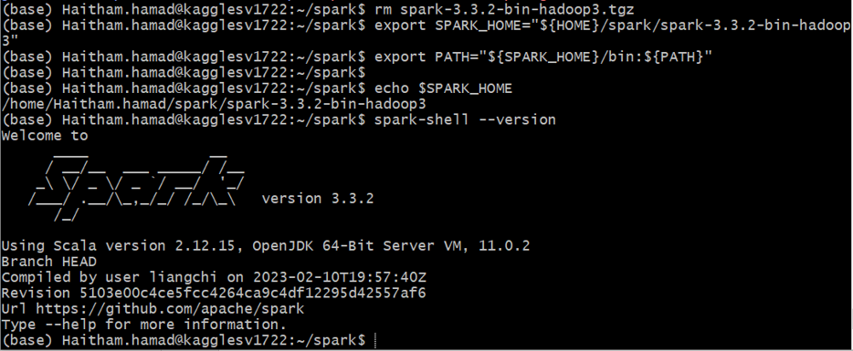
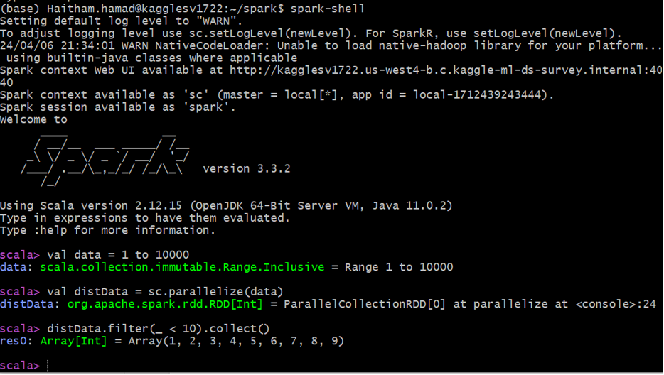

<!-- omit in toc -->
# Apache Spark Installation

Connect to the VM machine  
mkdir spark  
cd spark  

- [Install OpenJDK](#install-openjdk)
- [Install Apache Spark](#install-apache-spark)
- [Test Apache Spark](#test-apache-spark)

## Install OpenJDK  
```
wget https://download.java.net/java/GA/jdk11/9/GPL/openjdk-11.0.2_linux-x64_bin.tar.gz
tar xzfv openjdk-11.0.2_linux-x64_bin.tar.gz
```


Define JAVA_HOME and add it to PATH:
```
export JAVA_HOME="${HOME}/spark/jdk-11.0.2"
export PATH="${JAVA_HOME}/bin:${PATH}"
java --version
```


Remove the archive:
`rm openjdk-11.0.2_linux-x64_bin.tar.gz`

## Install Apache Spark
https://spark.apache.org/downloads.html

Install Spark version 3.3.2
```
wget https://archive.apache.org/dist/spark/spark-3.3.2/spark-3.3.2-bin-hadoop3.tgz
Unpack:
tar xzfv spark-3.3.2-bin-hadoop3.tgz
```


Remove the archive:
`rm spark-3.3.2-bin-hadoop3.tgz`

Add to PATH:
```
export SPARK_HOME="${HOME}/spark/spark-3.3.2-bin-hadoop3"
export PATH="${SPARK_HOME}/bin:${PATH}"
echo $SPARK_HOME
spark-shell –version
```


Download GCS and BigQuery spark connectors
From spark folder run
```
gsutil cp gs://hadoop-lib/gcs/gcs-connector-hadoop3-2.2.21.jar gcs-connector-hadoop3-2.2.21.jar
wget https://github.com/GoogleCloudDataproc/spark-bigquery-connector/releases/download/0.37.0/spark-3.3-bigquery-0.37.0.jar
```

## Test Apache Spark
Execute spark-shell and run the following:
```
val data = 1 to 10000
val distData = sc.parallelize(data)
distData.filter(_ < 10).collect()
```


Add the following variables to .bashrc
```
export JAVA_HOME="${HOME}/spark/jdk-11.0.2"
export PATH="${JAVA_HOME}/bin:${PATH}"

export SPARK_HOME="${HOME}/spark/spark-3.3.2-bin-hadoop3"
export PATH="${SPARK_HOME}/bin:${PATH}"

export PYTHONPATH="${SPARK_HOME}/python/:$PYTHONPATH"
export PYTHONPATH="${SPARK_HOME}/python/lib/py4j-0.10.9.5-src.zip:$PYTHONPATH"
```
