# Steps to provision Google infrastructure

- [Steps to provision Google infrastructure](#steps-to-provision-google-infrastructure)
  - [Prerequisities](#prerequisities)
  - [Install terraform](#install-terraform)
  - [Provision Google infrastructure](#provision-google-infrastructure)
  - [Verify provisioned infrastructure](#verify-provisioned-infrastructure)

## Prerequisities
1. Create Google cloud account for new user otherwise use your existing account
2. Create a new Project
   https://console.cloud.google.com
   https://console.cloud.google.com/projectselector2/home/dashboard?organizationId=0&supportedpurview=project
Choose a Project ID to use througout the project
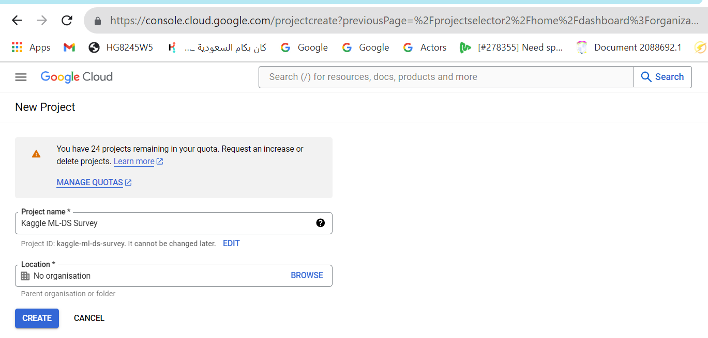

3. Enable APIs
   From Navigation menu
   Go to Compute Engine and enable API
   Go to Bigquery and enable API
4. [Download](https://git-scm.com/downloads) and install Git Bash for windows (Assuming you are working from a windows laptop) otherwise use the operating system compatible to your machine
5. Generate ssh key
   Open Git Bash
   ```
   mkdir .ssh
   ssh-keygen -t rsa -f ~/.ssh/gcp -C <your name> -b 2048
   ```
   Add the public key generated, gcp.pub, in this case to your google cloud account
   From Navigation menu, go to compute engine->Settings->metadata->SSH Keys->ADD SSH KEY
   Add the contents of the public key to the ssh key field
   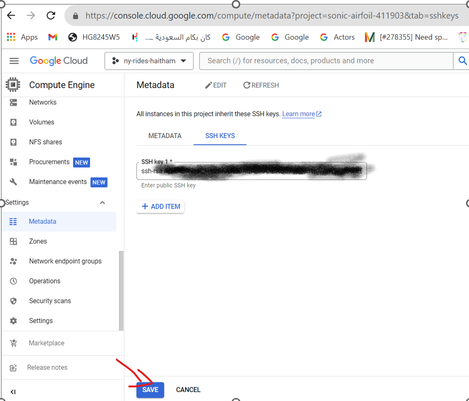
6. Create service account
   From Navigation menu, go to IAM and Admin->service accounts->create service account
   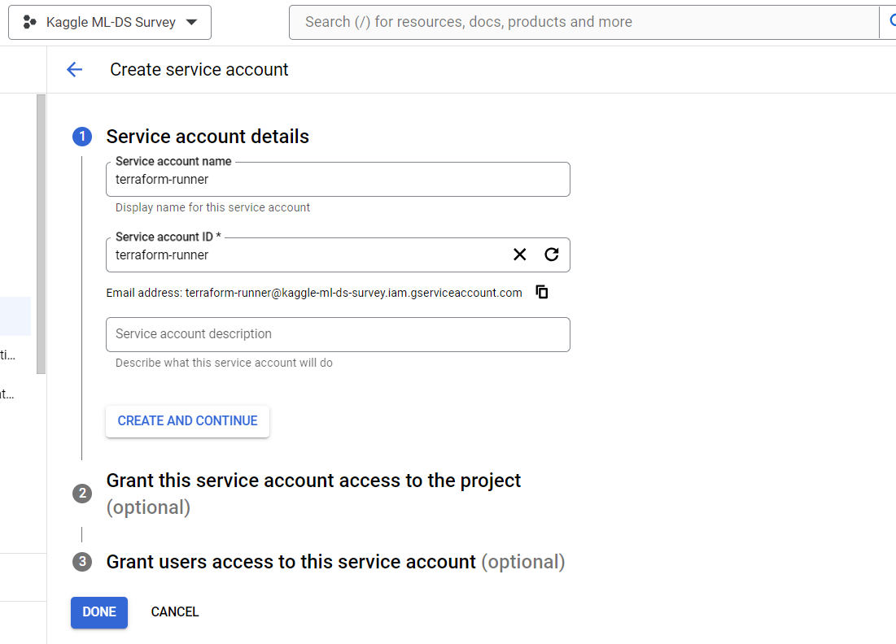
   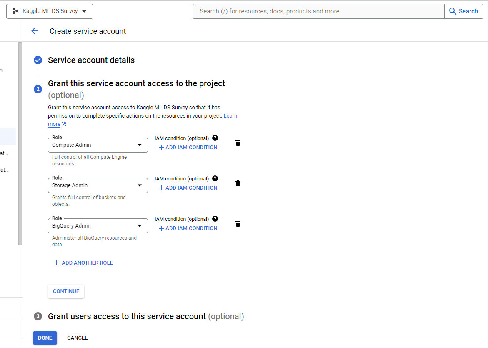
   Compute admin, Storage admin, and bigquery admin roles have been assigned to the service account. You may give more granular roles.
   Go to manage keys and add json key
   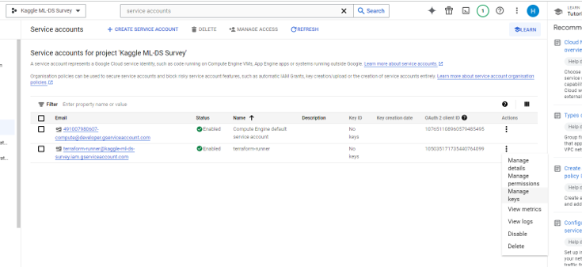
   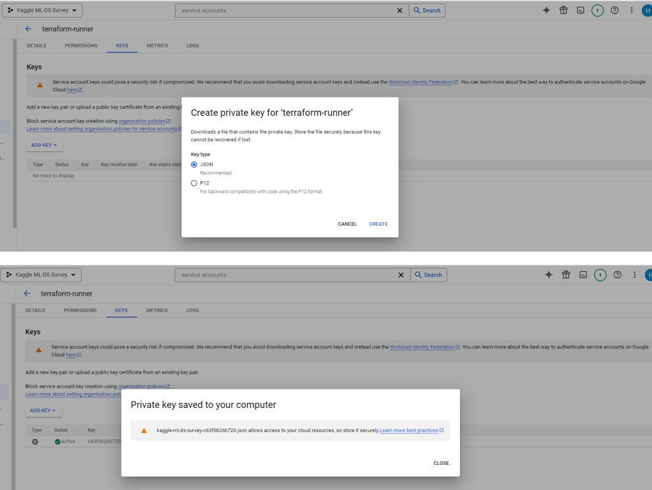  
   Copy the contents of the json key to terraform/keys folder on the VM.
7. grant service account access to the compute service account
   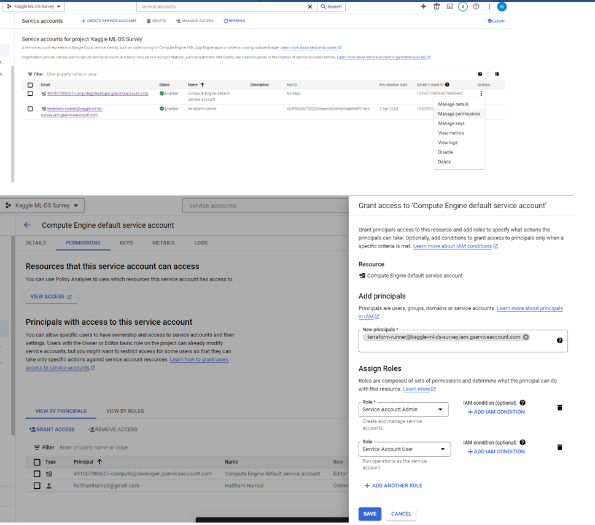

## Install terraform
1. Go to https://developer.hashicorp.com/terraform/install and download the terraform binaries to a terraform folder
   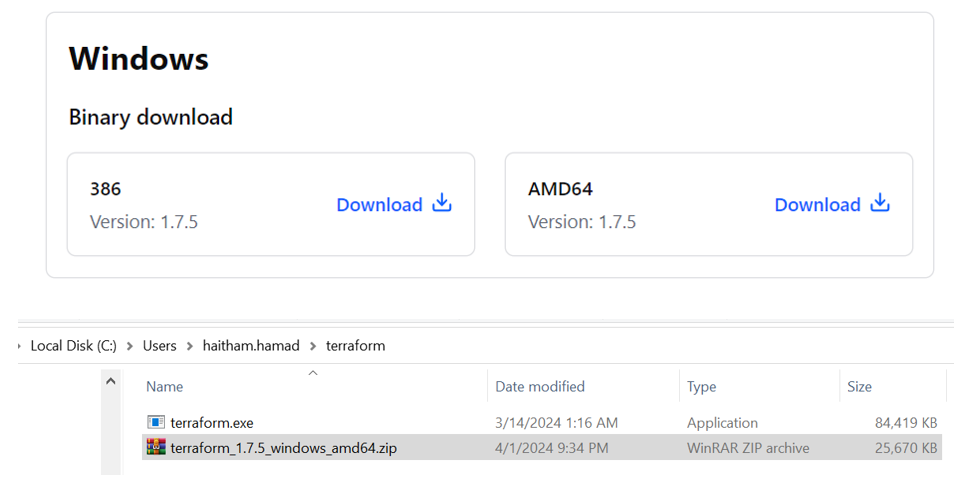
```
unzip terraform_1.7.5_windows_amd64.zip
rm terraform_1.7.5_windows_amd64.zip
```

**Add the terraform folder path to PATH environment variable**
1. Copy [main.tf](main.tf) and [variables.tf](variables.tf) to the terraform folder
2. Ensure the json key is under terraform/keys folder
3. Test terraform command works
   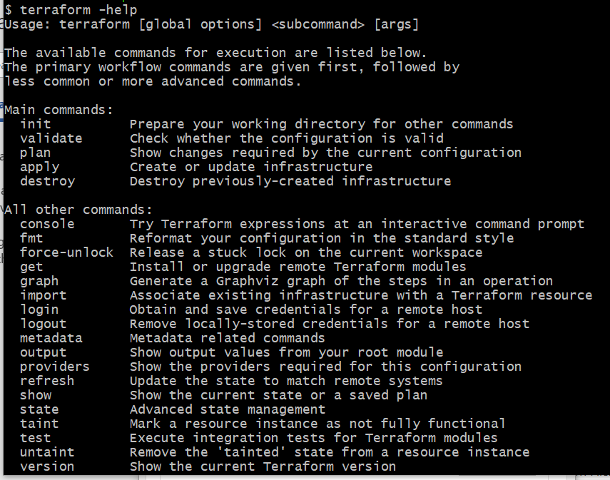

## Provision Google infrastructure
Running terraform will provision the following google cloud infrastructure components  
* Compute instance with Ubuntu os  
* Storage bucket  
* Bigquery dataset  
* static IP address  
* Firewall access to jupyter, spark, and mage ports  
terraform init
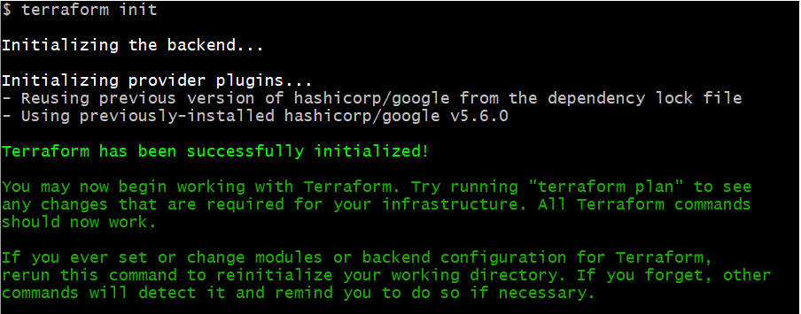
terraform plan "my_plan.out"
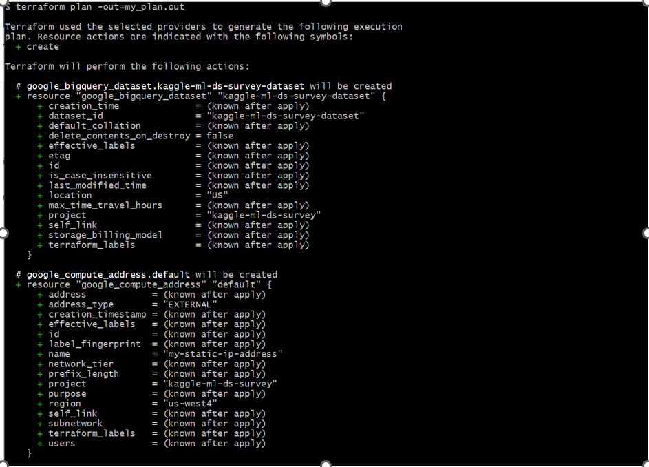

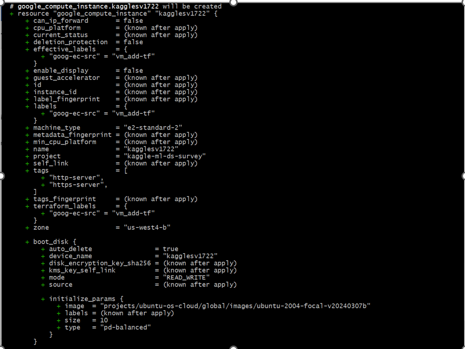
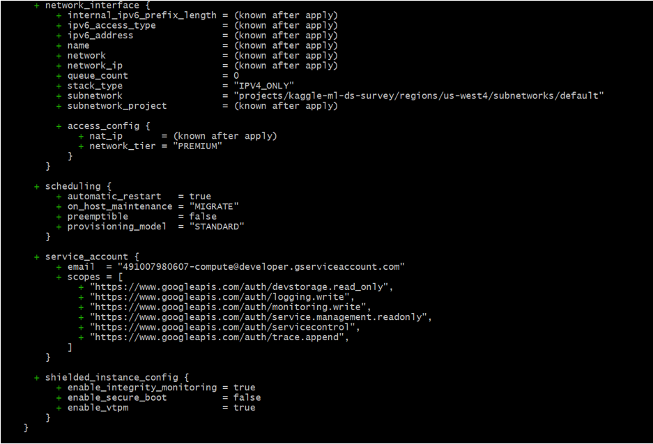
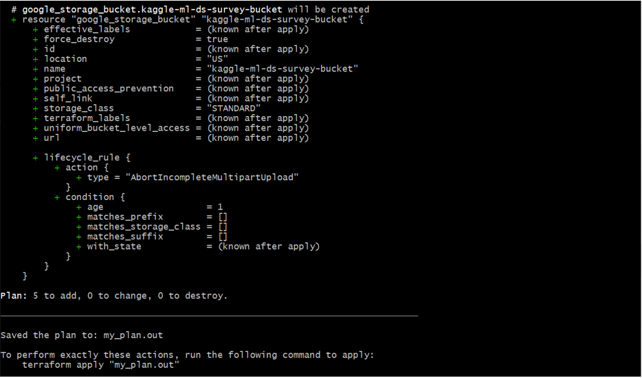
terraform apply "my_plan.out"
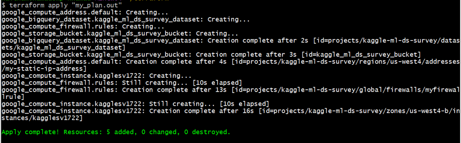


## Verify provisioned infrastructure
From Navigation menu
Go to Compute Engine -> VM instance
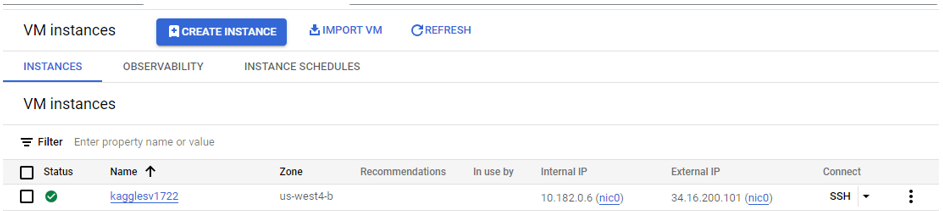

Go to VPC Network->Firewall
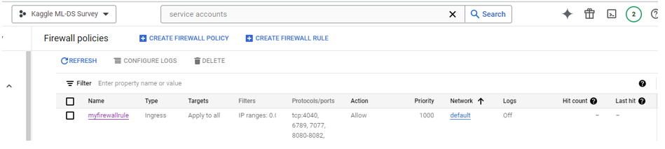

Go to Cloud Storage->Buckets
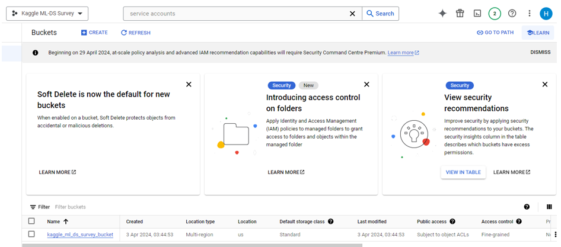

Go to BigQuery


ssh to the VM machine  
create file ~/.ssh/config
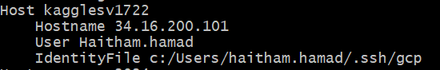
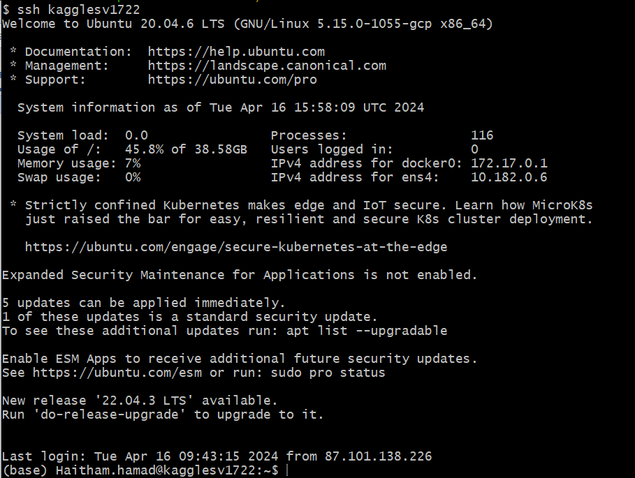
